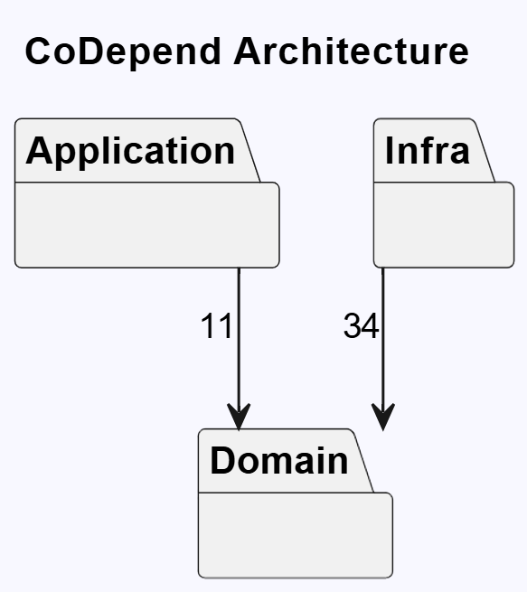
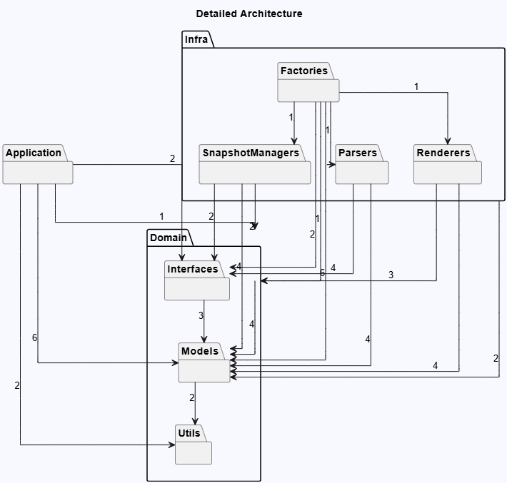
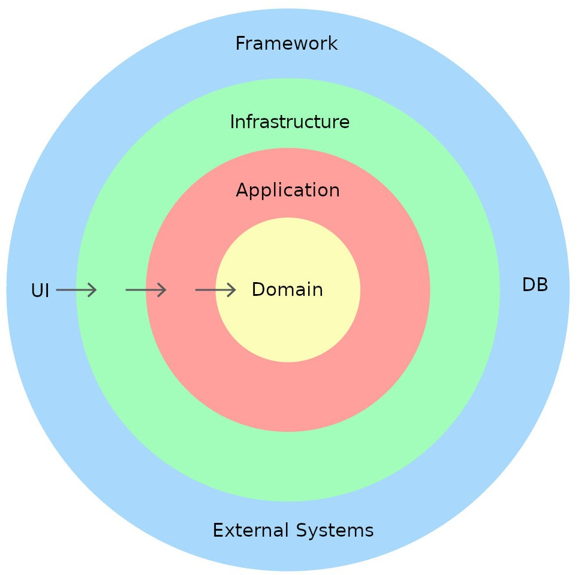

# CoDepend

Make sure to read the the `how_to_deliver_tasks` before reading this file.

CoDepend is a developer tool that parses source-code dependencies and generates architectural visualisations. It runs as both a CLI tool and a VS Code extension, supporting C#, Java, Kotlin, and Go projects.

## Getting CoDepend

Currently, CoDepend is under development and not yet published. Therefore the tool is not yet avaible to use.

## Getting Started

### Prerequisites

- [.NET 9.0 SDK](https://dotnet.microsoft.com/download/dotnet/9.0)
- [Visual Studio Code](https://code.visualstudio.com/)
- C# & C# Dev Kit extension for VS Code

### Building the Project

```bash
dotnet build ./CoDepend
```

### Running Tests

```bash
dotnet test ./CoDepend
```

### Running the CLI

```bash
dotnet run --project ./CoDepend
```

| format | diff |
|--------|------|
| `"puml"` (default) |  `false` (default) |
| `"json"` |  `true`  |

The tool reads an `codepend.json` configuration file that specifies the target project, output format, and dependency views. See `codepend.json` in the repository root for an example.

## Project Overview

The tool works in three stages:

1. Scanning: The file system is scanned for source files matching configured extensions. A change detector compares the current state against a saved snapshot to determine what has changed since the last run.
2. Parsing: Language-specific parsers extract `using`/`import` statements from changed files to build a dependency graph of internal project references.
3. Rendering: The dependency graph is rendered into views (PlantUML or JSON), filtered and grouped according to user-defined view configurations.

A snapshot of the dependency graph is persisted after each run, enabling incremental updates and diff-based visualisations that highlight structural changes between the local and remote codebase.

## Architecture

The codebase follows a layered architecture with three main layers and a thin CLI entry point:

<p float="center">
  
</p>
<p float="center">
   
  
</p>

**Domain** contains the core models and logic that are independent of any external framework or I/O concern.
**Application** contains the use cases that orchestrate the tool's workflow.
**Infra** contains all implementations that deal with external concerns / changing environments.
**Program.cs** is the CLI entry point.

### Dependency Policy

The project maintains a strict dependency direction between layers.
**Domain** can not depend on anything outside its layer.
**Application** can only depend on Domain and itself.
**Infra** can depend on both Domain and Application.
**Program.cs** can depend on everythig.
Dependencies always flow inward.

Please ensure that introduced changes, follows this dependency policy.

## Using ArchLens for development

This project uses ArchLens to ensure that the solution complies with the described architecture and dependency policies (described in the section above).

### Setup virtual environment

Run the setup script from the repository root:

Windows:

```pwsh
./setup_archlens.sh
```

Mac/Linux:

```bash
source ./setup_archlens.sh
```

OBS! This might take a while, however less than 5 minuttes.
This creates a Python 3.10 virtual environment in `./venv` and installs ArchLens. Once it completes, activate the environment:

Windows:

```pwsh
./.venv/Scripts/activate
```

Mac/Linux:

```bash
source ./.venv/bin/activate
```

### Installing ArchLens VS code extension

Please install the Archlens VS Code Extension by opening the visual studio code extensions tab, search for `ArchLens` and install the `ArchLens for VS Code`.

### Viewing visualisations

To see visualised architecture / dependency policy created by ArchLens, open the visualisation, press `ctrl` + `shift` + `p` (windows) or `cmd` + `shift` + `p` (mac), type `ArchLens` and select `ArchLens: Open Graph` (it might take up to 10 seconds before the graph appear).

> If the graph doesn't apprear or there is an error that pops up, then it is probably because your python interpreter is set to be other than 3.10. Try running `ArchLens: Open Setup`, then you should get the option to easily switch python interpreter.

To compare the branch dependencies with `main`, open the ArchLens visualisation window again and check on the `remote` checkbox in the top right corner.

## Configuration

The `codepend.json` file at the repository root configures the tool. Key fields:

| Field            | Description                                           |
|------------------|-------------------------------------------------------|
| `name`           | Project name used in output filenames                 |
| `rootFolder`     | Path to the source root, relative to the config file  |
| `fileExtensions` | Which file types to scan (e.g. `[".cs"]`)             |
| `exclusions`     | Directories or patterns to skip                       |
| `views`          | Named view configurations with package paths and depth|
| `saveLocation`   | Where rendered output files are written               |

Views control what appears in the generated diagrams. Each view specifies which packages to include, at what depth, and which packages to ignore.

## Contributing

When working on this codebase, please keep the following in mind:

- **Run the tests** before and after your changes: `dotnet test` from the root folder.
- **Follow existing code conventions**: the project uses primary constructors, file-scoped namespaces, and records where appropriate.
- **Place new code in the appropriate layer** based on what it does, not where it is convenient to put it. If you are unsure, look at how similar functionality is organised in the existing code.

### Tasks

See the project `CoDepend` connected to this repo for tasks that needs to be implemented.

## License

CoDepend uses MIT Licence.
